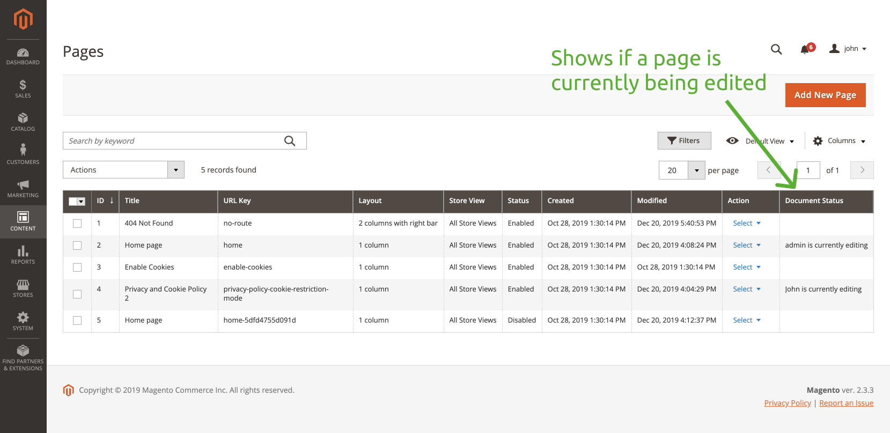

# CMS Page Status

The extension adds a new "Document Status" column on the Pages Listing page and shows a message when a page is being edited by an any admin user.

Available status changes:
* When a user opens an edit page, the document status is set to "edit".
* When a user closes an edit page, the document status is set to "closed".
* Page Listing Document Status column shows an edit status message "A user is currently editing the page".

The extension is under development, check out the [TODO](TODO.md) for the list of features and its status.

This extension is developed on the live coding streams on YouTube.
Past streams:
* [Stream from December 20, 2019](https://www.youtube.com/watch?v=ZnHZeXfJma4)
* [Stream from December 1, 2019](https://www.youtube.com/watch?v=lULJpQY2w0Q)
* [Stream from November 8, 2019](https://www.youtube.com/watch?v=sH0s-P3qwq8)
* [Stream from October 28, 2019](https://www.youtube.com/watch?v=Bso6kXpucdY)

## Contribute
Go ahead and grab an idea from the TODO and start work. Create a PR once finished.