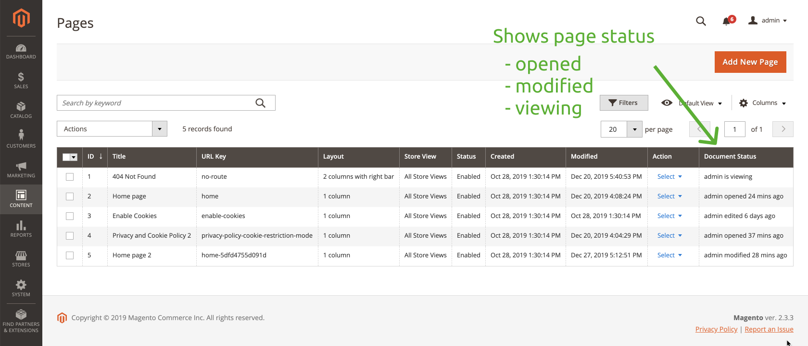

# CMS Page Status

The extension adds a new "Document Status" column on the Pages Listing page and shows a message when a page is being edited by an any admin user.

Available status changes:
* When a user opens a CMS Page in Magento Admin, the document status is set to "open".
* When a user closes a page, the document status is set to "not modified" or "modified".
* Page Listing Document Status shows one of the messages:
  * "user is currently viewing"
  * "user opened 10 mins ago"
  * "user edited 5 days ago"
  * "user modified 12 mins ago"

The extension is under development, check out the [TODO](TODO.md) for the list of features and its status.

This extension is developed during Live Coding streams on YouTube.
Past streams:
* [Stream from December 27, 2019](https://www.youtube.com/watch?v=oMTJFXnvgkI)
* [Stream from December 20, 2019](https://www.youtube.com/watch?v=ZnHZeXfJma4)
* [Stream from December 1, 2019](https://www.youtube.com/watch?v=lULJpQY2w0Q)
* [Stream from November 8, 2019](https://www.youtube.com/watch?v=sH0s-P3qwq8)
* [Stream from October 28, 2019](https://www.youtube.com/watch?v=Bso6kXpucdY)

## Contribute
Go ahead and grab an idea from the TODO and start work. Create a PR once finished.
